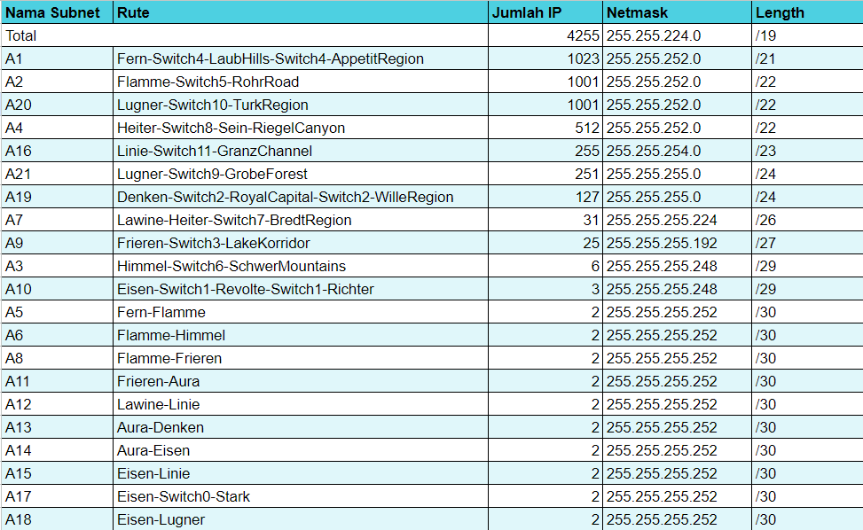
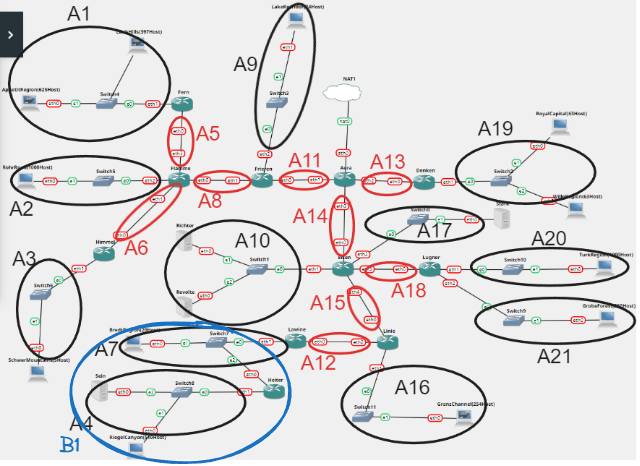
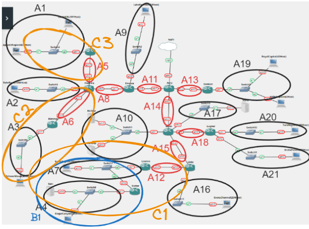
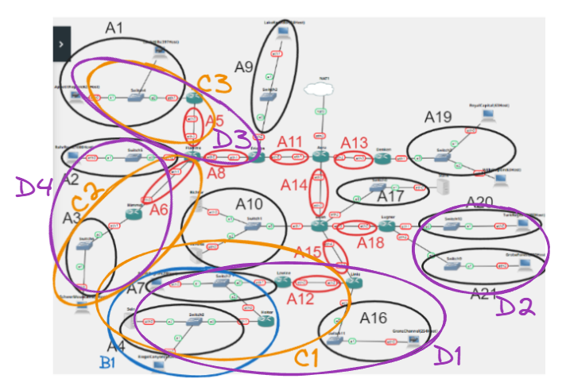
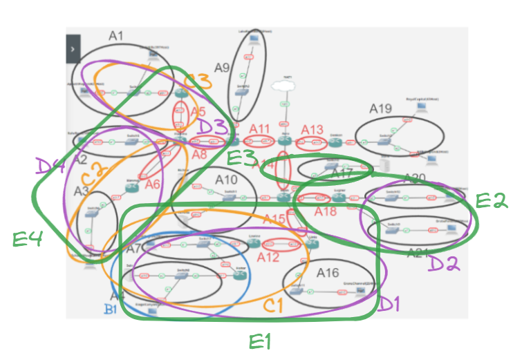
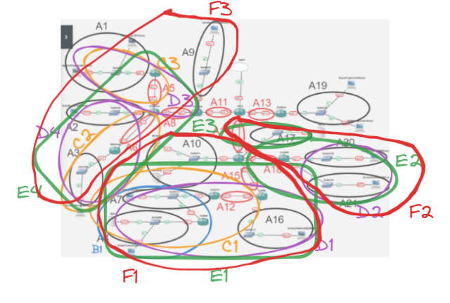
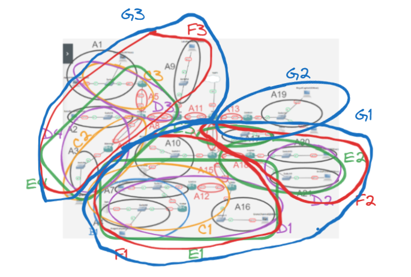
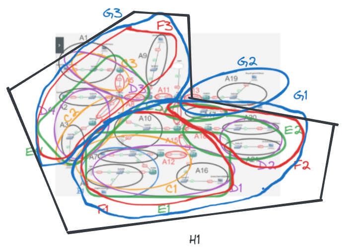
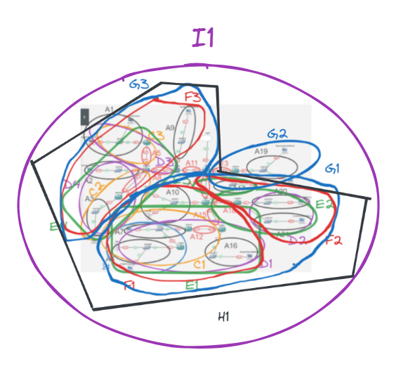

# Praktikum Jaringan Komputer 2023

**Kelompok IT08**

Nama Anggota Kelompok | NRP
------------------- | --------------		
Aqil Sulthan Yuki Maye | 5027211007
Adimas Defatra Bimasena | 5027211040

 Kelompok | Prefix IP 
----------|-----------
 IT08      | 192.237   

## Modul 4
Soal dikerjakan pada Cisco Packet Tracer dan GNS3 menggunakan metode perhitungan CLASSLESS yang berbeda.

Keterangan: Bila di CPT menggunakan VLSM, maka di GNS3 menggunakan CIDR atau sebaliknya

> Untuk pengerjaan soal, kami menggunakan Cisco Packet Tracer untuk metode VLSM dan GNS3 untuk metode CIDR

### Topologi


### VLSM
- Topologi Subnetting VLSM


- Konfigurasi Subnet VLSM

Menentukan subnet berdasarkan rute, jumlah IP, netmask, dan length


- Konfigurasi IP VLSM

Menentukan IP Network ID dan Broadcast tiap subnet serta netmasknya


- Tree VLSM

Membuat tree berdasarkan urutan IP VLSM dengan mask tertinggi


- Testing
Test ping konfigurasi VLSM


### CIDR
- Topologi Subnetting CIDR


- Konfigurasi Subnet CIDR

Menentukan subnet berdasarkan rute, jumlah IP, netmask, dan length


- Konfigurasi IP CIDR

Menentukan IP Network ID dan Broadcast tiap subnet serta netmasknya


- Penggabungan Subnet

> Pengabungan Pertama (B)


> Pengabungan Kedua (C)


> Pengabungan Ketiga (D)


> Pengabungan Keempat (E)


> Pengabungan Kelima (F)


> Pengabungan Keenam (G)


> Pengabungan Ketujuh (H)


> Pengabungan Kedelapan (I)


- Tree CIDR

Membuat tree berdasarkan urutan IP CIDR dengan mask tertinggi


- Konfigurasi CIDR GNS3
```
test
```


