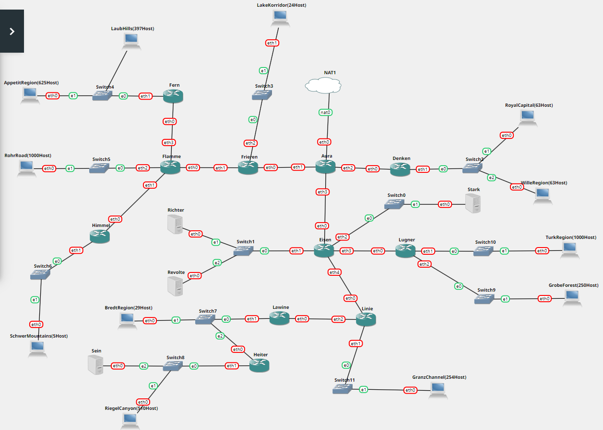

# Praktikum Jaringan Komputer 2023

**Kelompok IT08**

Nama Anggota Kelompok | NRP
------------------- | --------------		
Aqil Sulthan Yuki Maye | 5027211007
Adimas Defatra Bimasena | 5027211040

 Kelompok | Prefix IP 
----------|-----------
 IT08      | 192.237   

## Modul 4
### Topologi

### VLSM
- Topologi Subnetting VLSM

- Konfigurasi Subnet VLSM

Menentukan subnet berdasarkan rute, jumlah IP, netmask, dan length

- Konfigurasi IP VLSM

Menentukan IP Network ID dan Broadcast tiap subnet serta netmasknya

- Tree VLSM

Membuat tree berdasarkan urutan IP VLSM dengan mask tertinggi

- Testing
Test ping konfigurasi VLSM

### CIDR
- Topologi Subnetting CIDR

- Konfigurasi Subnet VLSM

Menentukan subnet berdasarkan rute, jumlah IP, netmask, dan length

- Konfigurasi IP VLSM

Menentukan IP Network ID dan Broadcast tiap subnet serta netmasknya

- Tree VLSM

Membuat tree berdasarkan urutan IP CIDR dengan mask tertinggi

- Testing
Test ping konfigurasi VLSM

